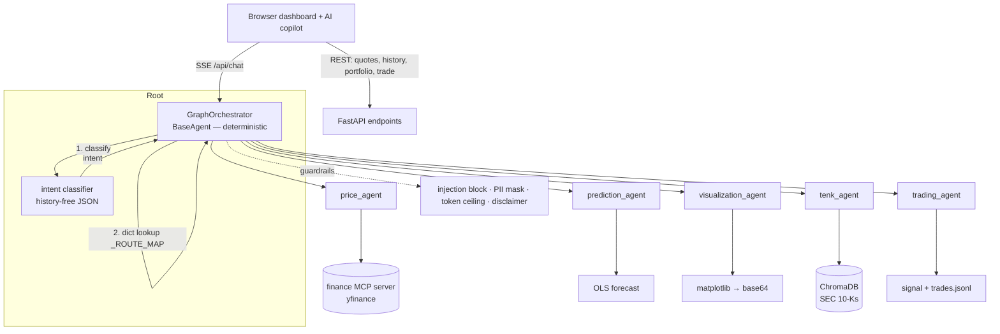

# FinanceAI — a multi-agent stock-analysis platform

A web trading-desk UI backed by a **deterministic multi-agent system** built on
Google's Agent Development Kit (ADK) and Gemini. Ask natural-language questions and
get streamed answers with live prices, linear-regression forecasts, inline charts,
cited passages from SEC 10-K filings, and a human-approved mock trading flow — all
inside a real dashboard (watchlist, interactive charts, portfolio, GUI trade ticket)
with an AI copilot alongside it.

> **Paper trading only.** No real orders are ever placed. Nothing here is financial advice.

<!-- TODO: add a demo GIF/screenshot here — it's the highest-impact thing on this page.
     Record a ~15s clip of: ask a price → forecast+chart → a 10-K question → a trade approval.
     Drop it at the repo root and reference it as  -->

---

## Why this project is interesting

The headline isn't "an LLM that answers stock questions" — it's **how the routing is
built.** No LLM decides which agent runs next. A history-free classifier produces an
intent, and a plain Python dict maps that intent to an ordered pipeline of specialist
agents. Routing is therefore **reproducible, unit-testable without a model, and cheap.**
Everything else — charts, RAG, trading — hangs off that deterministic spine.

| Capability | How |
|---|---|
| **Live prices & stats** | `price_agent` → yfinance via an MCP tool server |
| **Forecasts** | `prediction_agent` → pure-Python OLS regression over 3 months of closes |
| **Charts** | `visualization_agent` → matplotlib PNGs, delivered out-of-band to the browser |
| **10-K Q&A with citations** | `tenk_agent` → ChromaDB semantic search over SEC filings (RAG) |
| **Trade signals + approval** | `trading_agent` → weighted BUY/SELL/HOLD score, two-turn human approval |
| **Dashboard UI** | Watchlist, interactive SVG charts with forecast overlay, portfolio P/L, GUI trade ticket, AI copilot with chat history |

All of it sits behind a login (JWT + bcrypt), structured audit logging, input
guardrails (injection blocking, PII masking, token ceiling, enforced disclaimer), and
a regression-gated eval harness.

---

## Architecture



---

## A few engineering decisions worth reading the code for

- **Deterministic routing over an LLM router.** `intent → _ROUTE_MAP → pipeline` is a
  dict lookup, unit-testable with zero model calls.
- **History-free intent classification.** The classifier is a direct single-shot call,
  *not* an agent inside the ADK session — running it in the growing transcript made it
  "answer" instead of classify.
- **One-shot chart tools + out-of-band delivery.** Chart tools render a PNG entirely
  inside the function; an `after_tool_callback` strips the ~50 KB base64 *before* it
  reaches the model (it would tokenize to ~170 K tokens and hang) and ships the image to
  the browser via a `ContextVar`.
- **Guardrails placed by streaming semantics.** ADK fires `after_model_callback` on
  *every* SSE chunk, so PII masking and the token ceiling live in `before_model`,
  injection is blocked at the orchestrator before any model runs, and the disclaimer is
  enforced by the server after the answer is assembled — never in a per-chunk callback.

The full write-ups (cost tiering, per-user scoping, human-in-the-loop) live in the
**[app README →](app/README.md)**.

---

## Repository layout

```
.
├── app/          ← the application (start here)
│   ├── README.md         full setup, run, eval, and design-decision write-ups
│   ├── web_server.py     FastAPI: SSE chat + REST (quotes, portfolio, trade, sessions)
│   ├── static/           dashboard UI (vanilla JS + SVG, no build step)
│   ├── stock_agent/      orchestrator, agents, tools, guardrails, auth, RAG
│   └── eval/             regression-gated eval harness
├── arch/         ← architecture blueprint (orchestration, MCP, RAG, guardrails, …)
└── prd/          ← product requirements + epic/story breakdown
```

This repo deliberately keeps the **design docs alongside the code**. `arch/` and `prd/`
are the blueprint the implementation was built from; the app implements a
scoped-down v1 of that plan, with the larger surface documented as a roadmap.

---

## Quick start

```bash
cd app
python -m venv .venv && source .venv/bin/activate
pip install -r requirements.txt
cp .env.example .env          # then add your GOOGLE_API_KEY + a JWT_SECRET
uvicorn web_server:app --port 8080 --reload
```

Open <http://localhost:8080>, sign in, and try *"What's MSFT trading at?"*,
*"Forecast NVDA with a chart"*, *"What are Snowflake's risk factors?"*, or
*"Should I buy AMD?"* → reply **yes** to record a paper trade. Full instructions
(including building the 10-K RAG index and running the eval gate) are in the
**[app README](app/README.md)**.

---

## Roadmap (deliberately deferred from v1)

GraphRAG research agent · agent-to-agent (A2A) protocol · background price-alert
monitor · PDF report generation · role-based access control · cloud tracing
(LangFuse) + RAGAS-based RAG evaluation. See [app/README.md](app/README.md#planned-extensions-deliberately-deferred).

---

## Disclaimer

Educational project. Market data via the unofficial `yfinance` library may be delayed
or inaccurate. All trading is simulated (paper) — **not financial advice.**

## License

[MIT](LICENSE)
