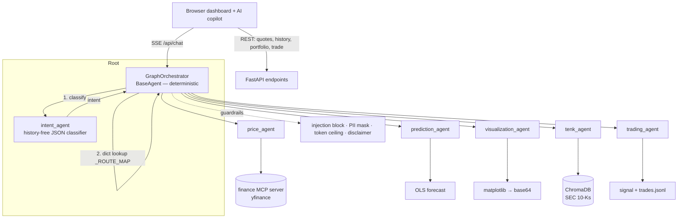

# FinanceAI — a multi-agent stock-analysis platform

A web trading-desk UI backed by a **deterministic multi-agent system** built on
Google's Agent Development Kit (ADK) and Gemini. Ask natural-language questions and
get streamed answers with live prices, linear-regression forecasts, inline charts,
cited passages from SEC 10-K filings, and a human-approved mock trading flow —
wrapped in a real dashboard (watchlist, interactive charts, portfolio, GUI trade
ticket) with an AI copilot alongside it.

> **Paper trading only.** No real orders are ever placed. Nothing here is financial advice.

---

## What it does

| Capability | How |
|---|---|
| **Live prices & stats** | `price_agent` → yfinance via an MCP tool server |
| **Forecasts** | `prediction_agent` → pure-Python OLS regression over 3 months of closes |
| **Charts** | `visualization_agent` → matplotlib PNGs, delivered out-of-band to the browser |
| **10-K Q&A with citations** | `tenk_agent` → ChromaDB semantic search over SEC filings (RAG) |
| **Trade signals + approval** | `trading_agent` → weighted BUY/SELL/HOLD score, two-turn human approval |
| **Dashboard UI** | Watchlist + live quotes, interactive SVG charts with forecast overlay, portfolio P/L, GUI trade ticket, AI copilot with chat history |

All of it sits behind a login (JWT + bcrypt), structured audit logging, input
guardrails, and a regression-gated eval harness.

---

## Architecture



**The routing spine is deterministic.** No LLM decides which agent runs next. The
orchestrator (a `BaseAgent`, not an `LlmAgent`) calls a history-free classifier to
get an intent, then looks the intent up in a plain Python dict (`_ROUTE_MAP`) to get
an ordered pipeline of specialists. This is the core engineering decision — it makes
routing reproducible, testable without a model, and cheap.

---

## Key design decisions

These are the parts worth reading the code for.

- **Deterministic routing over an LLM router.** `intent → _ROUTE_MAP → pipeline` is a
  dict lookup ([agent.py](stock_agent/agent.py)). The routing table is unit-tested with
  zero model calls, so a bad edit is caught for free by the eval harness.

- **History-free intent classification.** The classifier is a direct, single-shot
  `google-genai` call — *not* an agent inside the ADK session. Early on, running it
  inside the growing session made it degrade (it started "answering" instead of
  classifying). Pulling it out of the conversation made classification reliable
  ([intent_agent.py](stock_agent/intent_agent.py)).

- **One-shot chart tools + out-of-band delivery.** Chart tools fetch, compute, and
  render a PNG entirely inside the function, returning ~50 KB of base64. Left in the
  LLM's context that tokenizes to ~170 K tokens and hangs the model. An
  `after_tool_callback` strips the base64 before it reaches the model and ships the
  image to the browser through a `ContextVar` instead ([audit.py](stock_agent/audit.py),
  [tools.py](stock_agent/tools.py)).

- **Guardrails placed by streaming semantics.** ADK fires `after_model_callback` on
  *every* partial chunk under SSE. So PII masking and the token ceiling run in
  `before_model_callback` (they operate on the request), injection is blocked at the
  orchestrator *before any model runs*, and the financial-advice disclaimer is enforced
  by the server after the answer is assembled — never in a per-chunk callback
  ([guardrails.py](stock_agent/guardrails.py)).

- **Cost tiering by a one-line model map.** Cheap agents (classification, price,
  chart captions) run on `flash-lite`; reasoning agents (forecast, RAG, trading) run on
  `flash`. Swapping the whole stack's model is a single string change
  ([model_config.py](stock_agent/model_config.py)).

- **Per-user everything.** Trades, portfolios, and chat history are scoped to the
  authenticated user via a `ContextVar`, so a shared append-only log still yields a
  private portfolio per person ([trade_tools.py](stock_agent/trade_tools.py)).

- **Human-in-the-loop, two ways.** The chat flow proposes a trade and waits for a
  literal "yes"; the GUI trade ticket opens a confirmation dialog. Both are the human
  approval step. A server-side holdings check blocks overselling into negative shares.

---

## Tech stack

Python 3.11+ · **Google ADK** + **google-genai** (Gemini) · **FastMCP** (finance tools
over MCP/stdio) · **FastAPI** + **uvicorn** (SSE streaming) · **ChromaDB** +
**sentence-transformers** (`all-MiniLM-L6-v2`) for RAG · **yfinance** / pandas /
matplotlib · **PyJWT** + **bcrypt** (auth) · **aiosqlite** (persistent sessions) ·
vanilla JS + SVG frontend (no build step).

---

## Project structure

```
app/
  web_server.py            # FastAPI: SSE chat + REST (quotes, history, portfolio, trade, sessions, metrics)
  static/index.html        # dashboard UI (watchlist, charts, portfolio, trade ticket, AI copilot)
  stock_agent/
    agent.py               # GraphOrchestrator, _ROUTE_MAP, injection/disclaimer guardrails
    intent_agent.py        # history-free JSON intent classifier
    model_config.py        # model tiers + per-agent token caps
    price_/prediction_/visualization_/tenk_/trading_agent.py
    tools.py               # resolve_ticker, OLS forecast, one-shot chart renderers
    finance_mcp_server.py  # FastMCP stdio server (yfinance tools)
    tenk_tools.py          # ChromaDB RAG + warm-up thread
    trade_tools.py         # signal scoring, per-user paper trades, holdings guard
    guardrails.py          # injection, PII masking, token ceiling, advice/disclaimer
    audit.py               # JSON-lines logging + in-process metrics + tool callbacks
    auth.py                # bcrypt + JWT
    session_store.py       # chat-session metadata + transcript (sidebar/rehydration)
    market_data.py         # cached yfinance helpers for the REST layer
  eval/                    # cases.py, metrics.py, thresholds.yaml, run_eval.py
  scripts/download_10ks.py # SEC EDGAR ingestion → chunk → embed → ChromaDB
  data/                    # sqlite dbs, chroma index, trades/feedback logs (git-ignored)
```

---

## Setup & run

```bash
cd app
python -m venv .venv && source .venv/bin/activate
pip install -r requirements.txt

# configure secrets
cp .env.example .env    # then edit:
#   GOOGLE_API_KEY=...        (Gemini)
#   JWT_SECRET=...            (any long random string)
#   APP_USERNAME=... APP_PASSWORD=...   (seeds your login on first boot)

# (optional) build the 10-K RAG index — a few tickers to start
python scripts/download_10ks.py MSFT NVDA SNOW

uvicorn web_server:app --port 8080 --reload
```

Open <http://localhost:8080>, sign in, and try:

- *"What's MSFT trading at?"* · *"Forecast NVDA"* · *"Show me a chart of AMD"*
- *"What are Snowflake's risk factors?"* (cited from the 10-K)
- *"Should I buy AMD?"* → review the signal → reply **yes** to record a paper trade
- …or click **Buy** on the dashboard and confirm the ticket.

---

## Evaluation

A regression-gated harness scores intent-classification accuracy (real model calls)
and routing-table correctness (deterministic, no model):

```bash
python eval/run_eval.py            # print the scorecard
python eval/run_eval.py --gate     # exit non-zero if below thresholds (for CI)
python eval/run_eval.py --limit 8  # cheap partial run
```

Thresholds live in [eval/thresholds.yaml](eval/thresholds.yaml) (intent ≥ 0.80,
routing = 1.00, per `docs/accuracy.md`).

---

## Observability & safety

- **Audit log** — every agent/tool/model event is one JSON line in `audit.log`, with
  latencies and token estimates.
- **Metrics** — `GET /api/metrics` returns live counters + p95 latency/token samples.
- **Readiness** — `GET /ready` returns 503 until the RAG index has warmed up.
- **Guardrails** — prompt-injection is blocked before any model runs; emails/SSNs/phone
  numbers are masked out of model requests; a 120 K-token input ceiling is enforced;
  trade replies always carry a not-financial-advice disclaimer.

---

## Planned extensions (deliberately deferred)

This build implements the core that tells a complete engineering story. The blueprint's
larger surface is scoped out on purpose and would be the natural next steps:

- GraphRAG research agent (LightRAG / RAG-Anything) and multi-hop synthesis
- Agent-to-agent (A2A) protocol between specialists
- A background alert monitor (price thresholds → email)
- PDF report generation
- Role-based access control (currently every logged-in user can do everything)
- Cloud tracing (LangFuse) and RAGAS-based RAG evaluation
- Fernet-encrypted PII store (v1 masks in-memory per request)

---

## Disclaimer

Educational project. Market data via the unofficial `yfinance` library may be delayed
or inaccurate. All trading is simulated (paper) — **not financial advice.**
